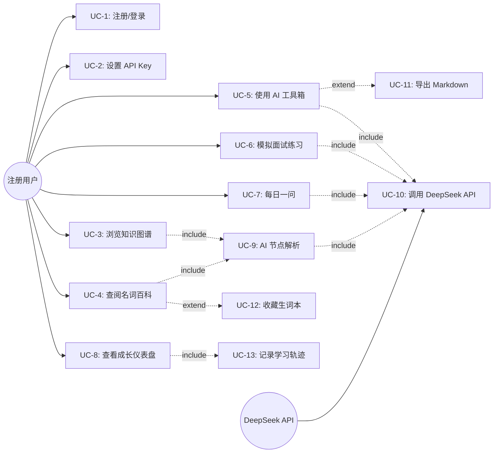
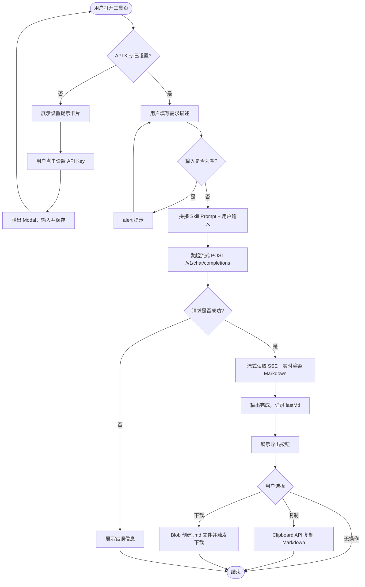
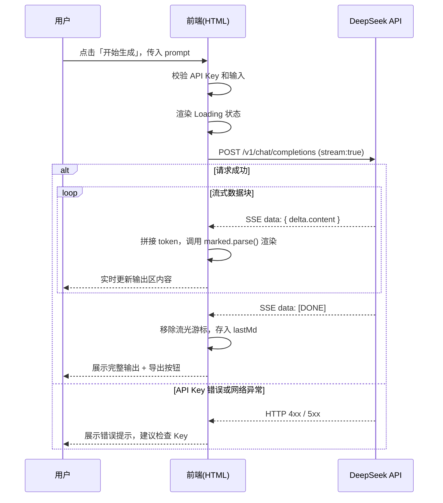
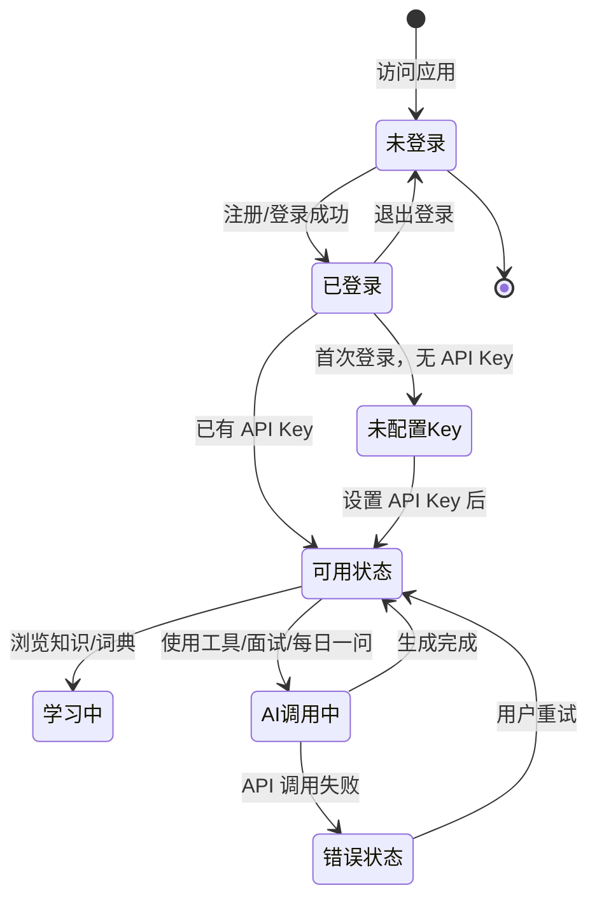

# PRD · AI PM 修炼场
**文档状态**：正式版 v1.0
**生成日期**：2026-06-03
**作者**：Hongzp
**技术栈**：HTML + CSS + JavaScript + DeepSeek API

---

## 一、产品概述

### 1.1 需求背景

AI 浪潮下，产品经理面临知识体系重构的压力：既需要掌握传统 PM 方法论，又需快速补充大模型、智能体、RAG 等 AI 产品专项知识。市场上的学习工具普遍存在以下问题：

- 知识碎片化，缺乏系统性框架
- 学习与实战工具割裂，学完不会用
- 无法针对个人学习轨迹做差异化反馈
- 面试准备和技能自测缺乏智能化支持

**AI PM 修炼场**定位为「系统化 PM 成长平台」，将知识学习、AI 实战工具、能力自测与成长追踪四条线整合于一个单页应用，以 DeepSeek API 为核心能力驱动，帮助 PM 快速构建完整的知识体系并应用于实际工作。

### 1.2 产品目标

| 核心指标 | 说明 | 目标值 |
|---------|------|--------|
| 用户日均使用时长 | 衡量内容粘性 | ≥ 15 分钟 |
| AI 工具调用次数 | 衡量实战价值转化 | 首周 ≥ 3 次/人 |
| 7 日留存率 | 衡量成长激励有效性 | ≥ 40% |
| 词典查阅次数 | 衡量知识获取深度 | 首周 ≥ 10 次/人 |
| 面试练习完成率 | 衡量技能自测功能价值 | ≥ 60% |

### 1.3 系统范围

| 组件 | 类型 | 说明 |
|------|------|------|
| 用户认证模块 | 前端 | 注册/登录/会话管理 |
| 知识体系库 | 前端静态 + AI 动态 | 图谱/专题/案例 |
| AI 实战工具箱 | 前端 + DeepSeek API | 市调/竞品/PRD/面试/每日一问 |
| 产品名词百科 | 前端静态 + AI 动态 | 词典/搜索/生词本 |
| 成长仪表盘 | 前端 + LocalStorage | 雷达图/成就/轨迹 |
| 数据持久层 | LocalStorage | 用户隔离存储 |

---

## 二、用户画像与场景

### 2.1 用户角色

**👤 转型 PM（主要用户）**
- 年龄：25-32 岁，非科班背景（工程师/运营/市场转型）
- 诉求：快速建立系统化 PM 知识框架，补齐 AI 产品专项短板
- 痛点：不知道该学什么、学了不会用、面试没信心

**👤 初中级 PM（核心用户）**
- 年龄：24-30 岁，0-3 年经验
- 诉求：用 AI 工具提升日常工作效率，系统准备跳槽面试
- 痛点：PRD 写作耗时长、竞品分析不系统、面试答题没框架

**👤 AI 方向 PM（高价值用户）**
- 年龄：26-35 岁，有一定 PM 经验，专项转 AI 产品方向
- 诉求：补充大模型/智能体等 AI 产品专项知识，掌握 AI 工具辅助工作流
- 痛点：AI 知识散乱、不知如何落地到产品设计

### 2.2 典型使用场景

**场景 1 — 日常学习（知识图谱 + 词典）**
用户利用碎片时间打开应用，在 PM 知识图谱中展开「数据分析」节点，点击「同期群分析」触发 AI 解释，理解概念后将其加入生词本，稍后在词典页复习。整个流程 5-10 分钟。

**场景 2 — 工作辅助（AI 工具箱）**
用户在做市场调研时，打开「市场调研助手」，输入「分析 AI 客服市场，背景是公司在考虑做该方向」，等待约 1 分钟后得到 12 章节完整调研报告，复制 Markdown 粘贴到飞书文档继续编辑。

**场景 3 — 面试备考（模拟面试官 + 每日一问）**
用户距离面试还有 2 周，每天打开「每日一问」完成一题获得 AI 评分，周末使用「模拟面试官」选择「AI 产品」方向进行多轮模拟，AI 追问后给出点评，用户记录改进点。

---

## 三、UML 用例模型

### 3.1 系统用例图



### 3.2 参与者定义

| 参与者 ID | 名称 | 类型 | 描述 |
|---------|------|------|------|
| Actor-01 | 注册用户 | Primary | 完成注册并登录的系统使用者 |
| Actor-02 | DeepSeek API | External | 提供 AI 对话生成能力的外部服务 |

### 3.3 用例列表

| 编号 | 用例名称 | 参与者 | 优先级 | 简述 |
|------|---------|-------|-------|------|
| UC-1 | 注册/登录 | 用户 | P0 | 账号创建与身份验证，用户数据隔离基础 |
| UC-2 | 设置 API Key | 用户 | P0 | 配置 DeepSeek Key，解锁所有 AI 功能 |
| UC-3 | 浏览知识图谱 | 用户 | P0 | 展开/折叠 PM 能力树状节点 |
| UC-4 | 查阅名词百科 | 用户 | P0 | 搜索/分类浏览/收藏 PM 术语 |
| UC-5 | 使用 AI 工具箱 | 用户、DeepSeek | P0 | 市场调研/竞品分析/PRD 生成三大工具 |
| UC-6 | 模拟面试练习 | 用户、DeepSeek | P1 | 抽题作答，AI 追问并点评 |
| UC-7 | 每日一问 | 用户、DeepSeek | P1 | 每日一题，AI 评分+解析 |
| UC-8 | 查看成长仪表盘 | 用户 | P1 | 雷达图/成就系统/学习轨迹 |
| UC-9 | AI 节点解析 | 用户、DeepSeek | P1 | 点击知识点触发 AI 深度解释 |
| UC-10 | 调用 DeepSeek API | 系统、DeepSeek | P0 | 流式请求，实时渲染输出 |
| UC-11 | 导出 Markdown | 用户 | P2 | 复制或下载 AI 生成内容 |
| UC-12 | 收藏生词本 | 用户 | P2 | 词典词条收藏与复习管理 |
| UC-13 | 记录学习轨迹 | 系统 | P1 | 自动记录用户行为，驱动仪表盘数据 |

---

## 四、详细用例规格

### UC-1 注册/登录

| 项目 | 内容 |
|------|------|
| **用例编号** | UC-1 |
| **优先级** | P0 |
| **触发条件** | 用户访问应用，未处于登录态 |
| **前置条件** | 无（首次使用） |
| **后置条件** | 用户进入主界面；会话存储 `sessionStorage`；用户数据命名空间 `user_{username}_` 初始化 |

**注册基本事件流**

| 步骤 | 用户动作 | 系统行为 |
|------|---------|---------|
| 1 | 切换至「注册」Tab | 显示注册表单（用户名/密码/确认密码/可选API Key） |
| 2 | 填写信息，点击「注册」 | 校验用户名唯一性；校验密码一致性 |
| 3 | — | 将 `{username: btoa(password)}` 写入 `pm_users`；若填写了 API Key 同步存储 |
| 4 | — | 显示「注册成功」，600ms 后自动进入主界面 |

**登录基本事件流**

| 步骤 | 用户动作 | 系统行为 |
|------|---------|---------|
| 1 | 填写用户名/密码，点击「登录」 | 与 `pm_users` 中存储的哈希值比对 |
| 2 | — | 比对通过，设置 `currentUser`，进入主界面 |

**备选事件流**

- **A1 用户名已存在**：注册时提示「用户名已存在」，表单不清空
- **A2 密码不一致**：提示「两次密码不一致」
- **A3 登录信息错误**：提示「用户名或密码错误」

**业务规则**

| 规则 | 内容 |
|------|------|
| BR-1.1 | 用户名唯一，以 `pm_users` 字典为准 |
| BR-1.2 | 密码以 `btoa()` 编码后存储（初版，不作强加密要求） |
| BR-1.3 | 所有用户数据以 `user_{username}_` 为前缀，同一浏览器多用户数据完全隔离 |
| BR-1.4 | 会话不持久化，关闭浏览器后需重新登录 |

---

### UC-5 使用 AI 工具箱

| 项目 | 内容 |
|------|------|
| **用例编号** | UC-5 |
| **优先级** | P0 |
| **子功能** | 市场调研助手 / 竞品分析器 / PRD 生成器 |
| **前置条件** | 1. 用户已登录；2. 已设置 DeepSeek API Key |
| **后置条件** | AI 生成内容展示完毕；学习轨迹记录「使用工具: XX」 |

**基本事件流**

| 步骤 | 用户动作 | 系统行为 |
|------|---------|---------|
| 1 | 侧边栏选择工具（市调/竞品/PRD） | 渲染对应工具页面，展示输入框和说明 |
| 2 | 输入需求描述，点击「开始生成」 | 校验输入不为空；显示 Loading 状态 |
| 3 | — | 拼接内置 Skill Prompt + 用户输入，发起流式请求至 DeepSeek API |
| 4 | — | 实时流式渲染 Markdown 输出（含流光游标动效） |
| 5 | — | 输出完成后渲染「复制 Markdown」「下载 .md 文件」按钮 |
| 6 | 点击「复制」或「下载」 | 执行对应导出操作 |

**备选事件流**

- **A1 未设置 API Key**：输出区展示提示卡片 + 「设置 API Key」按钮，不发起请求
- **A2 API 请求失败（4xx/5xx）**：展示错误信息「请检查 API Key 和网络连接」
- **A3 输入为空**：`alert('请填写需求描述')`，不发起请求

**内置 Skill Prompt 说明**

| 工具 | Skill 核心框架 | 输出结构 |
|------|--------------|---------|
| 市场调研 | 战略顾问视角 + 12章节分析框架 + A/B/C可信度分级 | 12章节报告 + 市场机会综合评分 |
| 竞品分析 | 竞争情报视角 + 6步推理链 + 诚实原则 | 12章节报告 + 分角色行动建议 |
| PRD 生成 | 七要素解析 + 三模式自适应 + Mermaid 图表 | 完整 PRD（含流程图/时序图/验收标准） |

---

### UC-6 模拟面试练习

| 项目 | 内容 |
|------|------|
| **用例编号** | UC-6 |
| **优先级** | P1 |
| **前置条件** | 用户已登录；已设置 API Key |
| **后置条件** | 对话记录存于 `interviewHistory`（页面级，不持久化）；轨迹记录「面试练习: XX」 |

**基本事件流**

| 步骤 | 用户动作 | 系统行为 |
|------|---------|---------|
| 1 | 选择面试方向（全部/AI产品/数据分析等） | 从28题题库中随机抽取对应分类题目 |
| 2 | — | 渲染对话区，展示第一道题（含分类标签和难度标注） |
| 3 | 在输入框填写回答，按 Enter 提交 | 将回答追加到 `interviewHistory`，渲染到对话区 |
| 4 | — | 携带完整对话历史调用 DeepSeek，System Prompt 指定面试官角色 |
| 5 | — | AI 返回追问或点评，追加到对话区 |
| 6 | 继续作答或点击「换题」 | 重复 3-5 步，或重置对话开始新题 |

**AI 面试官行为规则**

- 前 3 轮：只追问，不给答案，每轮 1-2 个深入问题
- 第 3 轮后：输出「【点评】」，含优点 2 条 + 改进点 2 条 + 参考框架

---

## 五、交互设计

### 5.1 业务流程图（核心 AI 工具调用）



### 5.2 时序图（流式 AI 请求）



### 5.3 用户数据状态机



---

## 六、功能详细设计

### 6.1 模块功能清单

#### 模块一：知识体系库

| 功能 | 实现方式 | 优先级 |
|------|---------|-------|
| PM 知识图谱（8大节点，48子节点） | 静态树状组件，展开/折叠交互 | P0 |
| 子节点 AI 解析 | 点击子节点触发 `askVocab()`，流式输出 | P1 |
| AI 产品专题（6主题卡片） | 静态卡片 + AI 点击解析 | P0 |
| 经典案例库（3个静态 + AI 动态） | 静态内置 ChatGPT/Notion AI/GitHub Copilot，输入框触发 AI 分析 | P1 |

#### 模块二：AI 实战工具箱

| 功能 | Skill 框架来源 | 优先级 |
|------|--------------|-------|
| 市场调研助手 | 市场调研 Skill v4（12章节+评分） | P0 |
| 竞品分析器 | 竞品分析 Skill v3（12章节+战卡） | P0 |
| PRD 生成器 | Ultimate PRD Pro v4.0（三模式+Mermaid） | P0 |
| 模拟面试官 | 28题题库+AI追问+点评 System Prompt | P1 |
| 每日一问 | 按日期循环出题+AI评分+提示功能 | P1 |

#### 模块三：产品名词百科

| 功能 | 实现方式 | 优先级 |
|------|---------|-------|
| 35条词典（9分类） | 静态数据，分类筛选 + 实时搜索 | P0 |
| AI 大白话解释 | 流式调用 DeepSeek，输出到页面底部 | P1 |
| 生词本收藏 | LocalStorage 存储，筛选「⭐生词本」Tab | P2 |

#### 模块四：成长仪表盘

| 功能 | 实现方式 | 优先级 |
|------|---------|-------|
| 4维统计数据（知识/工具/词典/面试） | 实时从 `user_{u}_stats` 读取 | P1 |
| 能力雷达图（6维度） | Canvas 原生绘制 | P1 |
| 成就系统（7个勋章） | 条件触发解锁，存入 `user_{u}_achievements` | P2 |
| 学习轨迹（最近40条） | 每次行为触发 `trackActivity()`，存入 `user_{u}_track` | P1 |

### 6.2 用户数据隔离设计

所有 LocalStorage Key 以 `user_{username}_` 为前缀，确保同一浏览器多账号数据完全隔离：

| Key | 内容 | 类型 |
|-----|------|------|
| `user_{u}_apikey` | DeepSeek API Key | String |
| `user_{u}_stats` | 各维度使用统计 | JSON Object |
| `user_{u}_track` | 学习行为轨迹列表 | JSON Array |
| `user_{u}_achievements` | 已解锁成就 ID 列表 | JSON Array |
| `user_{u}_vocab_saved` | 生词本收藏词条 | JSON Array |
| `user_{u}_daily_{date}` | 当日每日一问完成标记 | String `'1'` |
| `pm_users` | 全局用户注册表（共享） | JSON Object |

### 6.3 异常处理设计

| 异常场景 | 触发时机 | 系统处理 |
|---------|---------|---------|
| 未设置 API Key | 触发任意 AI 功能 | 输出区展示提示卡片 + 设置入口按钮 |
| API 请求失败（网络/4xx/5xx） | DeepSeek 调用异常 | 展示具体错误信息，提示检查 Key |
| 用户名已存在 | 注册提交 | 表单内联提示，不清空表单 |
| 密码不一致 | 注册提交 | 表单内联提示 |
| 登录凭据错误 | 登录提交 | 表单内联提示，不暴露具体原因 |
| 输入为空 | 工具箱点击生成 | `alert` 阻断提交 |
| 词典无匹配 | 搜索/分类筛选 | 展示空状态提示文案 |

---

## 七、验收标准（Given-When-Then）

### 注册/登录

**场景 1：首次注册成功**
- **Given** 用户在注册 Tab，填写未使用的用户名和两次一致的密码
- **When** 点击「注册」按钮
- **Then** 提示「注册成功！」600ms 后自动跳转主界面，侧边栏显示用户名

**场景 2：重复用户名注册**
- **Given** 用户填写已存在的用户名
- **When** 点击「注册」按钮
- **Then** 表单内显示「用户名已存在」，页面不跳转，表单不清空

**场景 3：登录凭据错误**
- **Given** 用户填写不存在的用户名或错误密码
- **When** 点击「登录」按钮
- **Then** 显示「用户名或密码错误」，不泄露具体原因

### AI 工具箱

**场景 4：正常生成报告**
- **Given** 用户已设置 API Key，在市场调研页填写需求描述
- **When** 点击「开始生成」
- **Then** 出现 Loading 提示；流式输出开始，内容实时渲染为 Markdown；完成后显示导出按钮

**场景 5：未设置 API Key 时使用工具**
- **Given** 用户未设置 API Key
- **When** 点击「开始生成」
- **Then** 输出区展示提示卡片，包含「设置 API Key」按钮，不发起网络请求

**场景 6：下载 Markdown 文件**
- **Given** AI 工具已生成内容
- **When** 点击「下载 .md 文件」
- **Then** 浏览器触发文件下载，文件名格式为 `PM修炼场_{日期}.md`，内容为原始 Markdown

### 数据隔离

**场景 7：多用户数据隔离**
- **Given** 用户 A 和用户 B 均在同一浏览器注册
- **When** 用户 A 收藏词汇、使用工具后，切换至用户 B 登录
- **Then** 用户 B 的生词本为空，学习轨迹为空，与用户 A 完全无关联

---

## 八、非功能需求

### 8.1 性能

| 指标 | 要求 |
|------|------|
| 页面首次加载 | ≤ 3s（含 marked.js CDN 加载） |
| 导航切换响应 | ≤ 200ms（纯前端渲染） |
| AI 首个 Token 到达 | ≤ 5s（受 DeepSeek API 影响） |
| LocalStorage 操作 | ≤ 10ms |

### 8.2 兼容性

| 平台 | 最低版本 |
|------|---------|
| Chrome | 80+ |
| Edge | 80+ |
| Safari | 13+ |
| Firefox | 75+ |
| 移动端 | 初版不强制适配，不保障布局 |

### 8.3 安全

- API Key 明文存储于 LocalStorage（初版，无加密）；提示用户注意信息安全
- 密码以 `btoa()` 简单编码（初版轻量处理，生产环境需升级为 bcrypt）
- 所有用户输入仅用于构建 Prompt，不执行任何代码
- 无服务端，无数据上传，数据完全本地化

---

## 九、影响范围与依赖

| 类型 | 内容 |
|------|------|
| 外部依赖 | `marked.js@9.1.6`（CDN：cdn.jsdelivr.net） |
| 外部 API | DeepSeek `/v1/chat/completions`（用户自备 Key） |
| 存储依赖 | 浏览器 LocalStorage（容量约 5MB，初版足够） |
| 无需服务端 | 完全静态单页应用，可直接部署至 GitHub Pages/Vercel/CDN |

---

## 十、风险评估

| 风险项 | 影响 | 概率 | 风险级别 | 应对策略 |
|--------|------|------|---------|---------|
| DeepSeek API 不稳定或限速 | 核心 AI 功能不可用 | 中 | 高 | 友好错误提示；后续支持多模型切换 |
| LocalStorage 被清除 | 用户数据全部丢失 | 中 | 中 | 文档说明风险；后续支持数据导出/备份 |
| CORS 跨域限制 | AI 功能在部分环境无法调用 | 低 | 中 | DeepSeek 支持浏览器端调用；测试覆盖主流浏览器 |
| marked.js CDN 加载失败 | Markdown 渲染降级为纯文本 | 低 | 低 | 内置 `typeof marked !== 'undefined'` 降级判断 |
| 用户 API Key 泄露 | 用户 DeepSeek 账单损失 | 低 | 高 | 文档提示不在公共设备使用；后续考虑加密存储 |

---

## 十一、后续迭代规划

### v1.1（短期）
- 扩充词典至 100+ 词条
- 面试题库扩充至 50+ 题，支持按难度筛选
- 每日一问增加历史答题记录页

### v1.2（中期）
- 支持多模型切换（OpenAI / Claude / DeepSeek）
- 用户数据导出（JSON 格式）
- PRD 生成支持自定义模板上传

### v2.0（长期）
- 引入服务端，支持云端数据同步
- 社区功能：分享学习记录 / 案例
- 个性化推荐：根据学习轨迹推荐知识点

---

## 十二、附录

### 12.1 术语表

| 术语 | 说明 |
|------|------|
| Skill Prompt | 内嵌于代码的专业级 Prompt 模板，用于驱动特定场景的 AI 分析 |
| 流式输出 | SSE（Server-Sent Events）协议，AI 生成内容逐 Token 实时展示 |
| 数据隔离 | 通过 LocalStorage Key 前缀区分不同用户数据 |
| DeepSeek API | 深度求索提供的大语言模型接口，兼容 OpenAI 格式 |
| marked.js | 开源 Markdown 解析库，将 AI 输出的 Markdown 渲染为 HTML |

### 12.2 文件结构

```
ai-pm-arena/
└── index.html          # 单文件应用，所有代码内嵌
    ├── <style>         # 全局样式
    ├── #auth-screen    # 注册/登录界面
    ├── #app            # 主应用（侧边栏 + 内容区）
    └── <script>        # 所有业务逻辑
```

### 12.3 快速检查清单

- [x] 注册/登录功能正常，数据隔离验证通过
- [x] API Key 设置弹窗正常开关
- [x] 知识图谱节点展开/折叠交互正常
- [x] AI 工具箱三个工具均可正常调用并流式输出
- [x] PRD/市调/竞品输出后显示导出按钮
- [x] 模拟面试多轮对话历史正确传递
- [x] 每日一问每天仅可提交一次
- [x] 词典搜索/分类/收藏功能正常
- [x] 成长仪表盘数据实时更新
- [x] 能力雷达图 Canvas 正常渲染
- [x] 未设置 API Key 时有友好提示
- [x] 所有 LocalStorage 操作有数据隔离
